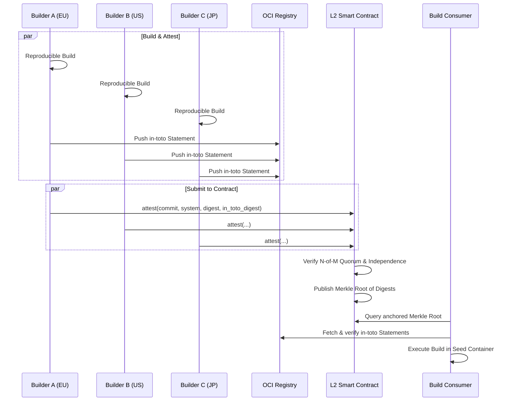

# Nix Seed: Design

## Goals

1. Happy-path builds - application code change only, no dependency update -
   start *building* in \<10s on a standard ephemeral Linux CI runner. See
   [Constraints](#constraints) for platform support.

## Prerequisites

1. Reproducible builds are a hard prerequisite. Without reproducibility,
   diverging digests are indistinguishable from a subverted build.

## Performance

### Comparisons

Generates CI workflows for ./examples/ that benchmark setup-time against
cache-based approaches (public binary cache, `actions/cache`) so the improvement
is measurable, not assumed.

The benchmark command is:

- `nix develop --command true`

### Instrumentation

Jobs are instrumented with [OpenTelemetry] spans for:

- seed pull
- mount ready
- build start/end
- post build: provenance/SBOM generation and signing
- registry push: if outputting an OCI image

Primary metric: time-to-build (setup time).

## Building the Seed

Seed build is managed by the [Seed Action](./seed/action.yaml)

Output references are system-qualified at evaluation time: `apps.default`
resolves to `apps.x86_64-linux.default` on an x86_64-linux builder. All
configured outputs are built in parallel. Projects with large independent
outputs should use separate CI jobs per output to distribute build load across
dedicated runners.

### Closure Manifest

A seed's trust anchor is its closure manifest, not its image digest.

The manifest lists every store path in the image closure with that path's NAR
hash, one path per line, formatted `<narHash>  <path>` and sorted by path in the
C locale. The manifest digest is the SHA-256 of that file.

Two honest builders in independent failure domains can realise identical store
paths and still disagree on the image digest. Layer compression settings, the
byte ordering the image manifest serialises in, and the versions of the tools
producing both are not part of what Nix reproduces. Comparing image digests
turns that into a quorum failure: a release blocked on a disagreement that does
not exist. NAR hashes are precisely what Nix does guarantee, which makes the
manifest the correct unit of comparison.

The image digest remains the pointer used to fetch the seed, and is not
authoritative. A consumer verifies the fetched closure against the manifest.

The manifest is derived from the image's `copyToRoot` closure via
`exportReferencesGraph`, so it describes what the image contains rather than
what it was asked to contain. It is also independent of how the closure is
delivered, which is what lets a future non-OCI mechanism (see [macOS](#macos))
share the same anchor.

## Building from Seed

Consuming projects maintain a `.seed.lock` recording, per target system, the
[closure manifest](#closure-manifest) digest a build must reproduce and the
mechanism that delivers it:

```json
{
  "version": 1,
  "systems": {
    "aarch64-linux": {
      "kind": "oci",
      "manifest": "sha256:...",
      "image": "sha256:..."
    },
    "x86_64-linux": {
      "kind": "oci",
      "manifest": "sha256:...",
      "image": "sha256:..."
    }
  }
}
```

- `version` gates format migrations. A consumer that does not recognise the
  value MUST fail rather than guess.
- `kind` names the delivery mechanism. `oci` is the only value today; the
  [macOS](#macos) options would add others.
- `manifest` is the authoritative anchor and is independent of `kind`.
- `image` is the fetch pointer for `kind: oci`, and is not authoritative.

`version` and `kind` are present while a single mechanism exists because
`.seed.lock` is committed by every consuming project: adding a discriminator
later is a migration across all of them.

If no entry exists for a system, [the seed is built](#building-the-seed), the
resulting entry is recorded in a new commit containing the updated `.seed.lock`,
and the normal build proceeds.

### Delivery

The seed is a single squashfs image, pushed as one OCI layer with media type
`application/vnd.nix-seed.squashfs`. Store paths sit at the image root, so the
image *is* `/nix/store` once mounted. Two pieces of metadata ride inside it
under `.seed/`, as squashfs pseudo-files, which is what makes the image the
seed's only artefact: `registration`, the `nix-store --load-db` dump that marks
the baked paths valid in a fresh database, and `env`, a symlink to a `buildEnv`
providing `bin/` for `PATH` and `etc/nix/nix.conf` for the build configuration.

The consumer pulls the blob straight from the registry with four parallel
range requests on separate connections: the blob endpoint redirects to
CDN-fronted storage that honours ranges. Measured on the rust seed (654 MB on
`ubuntu-22.04-arm`, 579 MB on `macos-15`) that is 1-2s and 3.6s at the median
against 4-14s for an `actions/cache` restore of the same bytes, with no save
step, size cap or eviction. It has a tail the cache did not: about one fetch in
five on arm took 14-34s during busy hours, cold or warm, on varying storage
shards; a stream under 2 MB/s for 10s is aborted and re-requested for that
reason. A sweep of 1-64 streams, six samples each: multiplexed over one HTTP/2
connection (curl's default) it was flat from 1 to 64 (arm ~230 MB/s, macOS
~150 MB/s), the one connection's window being the limit; with a connection per
stream four had the best median on both runners (arm 1.1s at up to 670 MB/s,
macOS 3.6s), 16 and beyond pay for the extra connections, and a single stream
is the one setting that pays for a cold edge (7-13s). An
`actions/cache` entry as the primary path with this fetch as the miss path was
tried and dropped in favour of the better median and the simpler action. The
consumer verifies the bytes against the digest in `.seed.lock`, and mounts them
as a pair:

```sh
mount -t squashfs -o loop,ro store.squashfs /nix/.ro-store
mount -t overlay overlay \
  -o lowerdir=/nix/.ro-store,upperdir=/nix/.rw/upper,workdir=/nix/.rw/work \
  /nix/store
```

The lower layer is read-only and compressed, decompressed per block on demand.
The upper layer takes everything the build writes. Nothing is extracted and no
container is involved: the build runs directly on the runner, against the
seeded Nix on `PATH`.

**Mount, never extract.** This is the property the whole design rests on, and
the one any port must preserve. Mounting is constant time regardless of closure
size, while extraction is bound by file count — and these are closures of tens
of thousands of files, 65-728 MB compressed. Extraction is the difference
between the [\<10s goal](#goals) and missing it.

Offline-ness is *configured*, not confined: the baked `nix.conf` carries no
substituters and sets `substitute = false`, so a build reaches nothing but the
mounted closure. A consumer who needs that enforced rather than configured
wraps the build in `unshare --net` - which macOS has no equivalent of, so
there the property is configured only.

### macOS

macOS has no loop-mounted squashfs and no overlayfs, but it has the same
read-only-plus-writable pair under different names, and both halves ship with
the OS - no kernel extension, no macFUSE, nothing requiring an approval dialog
on a hosted runner:

| Linux | macOS |
| --- | --- |
| squashfs, compressed, read-only | UDIF `.dmg`, uncompressed, read-only |
| `mount -t squashfs -o loop,ro` | `hdiutil attach` |
| overlayfs upper | `hdiutil attach -shadow` |

`-shadow` diverts writes to a sparse file beside the image, leaving the base
untouched: copy-on-write at the block layer rather than the file layer. So
nothing is extracted on either platform, which is the property that had to
survive the port.

Four things differ, and each is a consequence of the platform rather than a
choice:

- **The mountpoint must be conjured.** Since Catalina the root volume is
  sealed, so `/nix` cannot simply be created. A `/etc/synthetic.conf` entry
  plus `apfs.util -t` materialises it without a reboot. That call reports
  failure even when it succeeds, so the consumer tests for the directory
  rather than trusting the exit status, and the flag is spelled `-B` before
  macOS 26.
- **The filesystem must be case-sensitive.** A store holds paths differing
  only in case, and both APFS and HFS+ default to insensitive. The base image
  is Case-sensitive Journaled HFS+, not APFS: attach cost tracks file count
  (see below), and HFS+'s flat catalog B-tree is lighter to walk per file on
  attach than APFS's copy-on-write object map. The image used APFS
  originally; six rounds each way on `python` and `rust` measured attach
  dropping from 4-5s to about 1.2-1.3s on both, with no overlap between the
  two sample ranges. Load-db got moderately slower on both (about 1.1-1.3s to
  about 1.6-1.7s) despite writing to a plain directory outside the image
  entirely, which the filesystem choice should not affect; read as noise
  rather than a real cost until it recurs.
- **Ownership comes from the mount, not a `chown`.** Linux gets a cheap chown
  from an overlayfs copy-up of the merged root; `hdiutil` has no analogue, so
  the image is attached `-owners off`, which presents it as the mounting
  user's. Nix then runs unprivileged exactly as on Linux.
- **`/nix/var` is a symlink out of the image, not a directory in it.** The
  synthetic `/nix` mountpoint accepts only a single mount - a subdirectory
  cannot be pre-created under it to attach the store alone - so the whole
  image is still attached at `/nix`. `/nix/var` inside it is a symlink to a
  fixed path, `/private/var/nix-seed`, which the consumer creates as an
  ordinary directory before attaching. Baking `/nix/var` as a real directory
  in the image (the first design) put every database write behind the
  `-shadow` file's copy-on-write, the same block-level indirection that makes
  attach itself expensive - `nix-store --load-db` cost about 1s there against
  0.15s for the identical write on Linux's native `/nix/var`.
- **The image is written by a derivation that declares its escape.**
  `hdiutil` talks to `diskarbitrationd` and the DiskImages helper, mach
  services the sandbox denies, so unlike `mksquashfs` it cannot run in a
  sandboxed `runCommand`. The darwin branch of `mkSeed` therefore sets
  `__noChroot`, which Nix honours where the builder sets `sandbox = relaxed`
  - `seed/action.yaml` sets it on macOS only. The image is a derivation
  output like the squashfs is, and `/usr/bin/hdiutil` and `/usr/bin/ditto`
  are the only implicit host dependencies left; `zstd` is a declared input.

  The output is not byte-reproducible - `hdiutil` stamps a volume UUID and a
  creation time - which is exactly why the
  [closure manifest](#closure-manifest), not the image digest, is the
  anchor.

  **Copy into a mounted volume, don't hand `hdiutil` a folder.** Store
  paths are dittoed into a mounted read-write sparse image, four workers
  under `xargs -P 4`, and the result converted to UDRO. Building the image
  in one pass from a hardlink farm with `create -srcfolder` avoids the
  mount, the copy and the convert entirely and ought to win; measured, it
  lost on three of four examples. Packaging went eval-heavy 34s -> 102s,
  curl 56s -> 190s and python 120s -> 285s, with only rust improving (276s
  -> 190s). The farm also has to live on the store's own filesystem - the
  installer gives `/nix` a separate APFS volume, so linking out of
  `/nix/store` into a build directory under `/private/tmp` fails with
  `EXDEV`, which costs a `build-dir` setting on the builder. Neither the
  farm nor that setting is worth it at those times.

  Ownership is the subtlety in either approach. The store is root's and a
  build runs as a `nixbld` user, so anything preserving ownership asks
  `hdiutil` to authenticate for files it does not own - fatal in a build
  ("user interaction required for authorization"; outside nix it hangs on
  the prompt for 38 minutes instead). Attaching the scratch volume
  `-owners off` removes the question: the volume presents as the copying
  user's. It is moot in the end, because the consumer attaches `-owners
  off` too.

  Declaring the escape was chosen over the alternatives after each was
  tested. Nothing creates an HFS+ filesystem in userspace: Apple's
  `newfs_hfs` requires a block device (the `DKIOCGETBLOCKSIZE` and
  `DKIOCGETBLOCKCOUNT` ioctls are unconditional, and only `-N`, a dry run,
  skips them), the Linux port that does format plain files is Linux-only,
  and `libdmg-hfsplus` has no formatter at all - it writes a valid HFSX
  catalog into an existing volume, verified against an independent reader,
  but follows symlinks and drops modes while doing it. ISO 9660 with Rock
  Ridge *can* be written in the sandbox and carries everything a store
  needs, including paths differing only in case, but macOS mounts `cd9660`
  read-only: `-shadow` makes the block device writable, not the filesystem
  above it, and the store has to accept the consumer's own build outputs.

Measured on `macos-15` (Apple Silicon), five rounds per example. The image is
shipped **uncompressed** (UDRO) inside a zstd stream, which the consumer decodes
once before `hdiutil attach`. The first design attached a compressed (lzfse,
ULFO) image directly, and the reversal is the most important Darwin finding:

- **Attaching a compressed image is not constant-time.** `hdiutil attach`
  reads the volume's metadata while mounting, and on a compressed UDIF image
  every read decompresses a chunk. `rust`'s lzfse image took 22-28s to attach
  in every round against 6-11s for `python`'s *larger* one: the cost tracks
  inodes, not bytes. `-noverify` and `-noautofsck` change nothing. Uncompressed,
  the same images attach in 1-2s and 4-5s.
- **So is everything that reads the store afterwards.** Evaluating nixpkgs off
  the mounted image is a random-read workload. On lzfse the same flake took
  4-39s (`python`) and 3-22s (`rust`) run to run; uncompressed it sits in a
  1.5s band at the bottom of that range.
- **The transfer does not get bigger.** zstd over raw blocks beats lzfse:
  `rust` 704 -> 593 MB, `python` 864 -> 673 MB. Pushed raw to the registry,
  though, the image is 3-3.8 GB and the seed's push step went from ~35s to
  ~200s. So `mkSeed` wraps it in zstd for transport and `bin/mount-seed`
  decodes it once before attaching, the same shape as Linux: compressed at
  rest, plain blocks under the mount.

Net effect per warm `macos-15` job: `rust` 72s -> 29-47s, `python` 66s ->
42-49s, `eval-heavy` 30s -> 22-29s. Linux never had the problem: squashfs
decompresses lazily per block in the kernel with the page cache in front of it.

An earlier codec comparison (lzma against lzfse: ~27% smaller blobs, consumers
no faster, seeds 50-200s slower) pointed the same way - decompression on read
was giving back what the smaller transfer saved - but the attach measured about
4.4s on a trivial closure at the time, so the cost was attributed to the
transfer rather than the codec.

Darwin seeds are built on Darwin (see [Constraints](#constraints)), so seeding
has a macOS leg rather than a cross-compilation step. The artefact a consumer
fetches follows from the system it is for: `*-linux` gets `store.squashfs`,
`*-darwin` gets `store.dmg.zst`, and `.seed.lock` needs no discriminator
because its keys already say which system each digest belongs to.

Rejected on the way, both for extracting rather than mounting: pulling the
blobs and unpacking them onto the host's `/nix`, and publishing the closure as
an archive to a local `file://` binary cache. [Tart] would give a real Darwin
guest with real isolation, but needs a host that permits VMs, so it answers
self-hosted builders rather than hosted CI.

After each build, an [in-toto] statement is generated describing inputs and
build metadata, signed via [OIDC]/[KMS] using [cosign], logged to [Rekor], and
For distribution, [Cachix](https://cachix.org/) provides a managed binary cache
service for store path results. Cachix push credentials are a deployment secret,
not a trust root. Container outputs are pushed to an OCI registry. Cachix is not
required when all outputs are container images; it is recommended for store path
outputs and dev shells.

Nix store signing (`nix store sign`) attaches an [Ed25519] signature to each
[narinfo] in the cache, binding the store path to the signer's key. A consumer
configured with `trusted-public-keys` verifies the signature before accepting a
substituted path. In [Zero](#zero), store signing is complementary to the
quorum: a compromised cache can serve a valid signature only if the signing key
is also compromised, while the anchored digest provides an independent ground
truth.

### Building Containers

> Nix Seed is not a container-building tool. Container images are one possible
> Nix derivation output. Their layers are store paths, packaged by
> [nix2container](https://github.com/nlewo/nix2container). Nothing about a
> container build is special relative to any other Nix output.

The release pointer for a container build is the OCI image digest
(`ghcr.io/org/repo@sha256:<digest>`). Registry tags and metadata are
non-authoritative, and so is the image digest itself for quorum purposes:
builders compare the [closure manifest](#closure-manifest) digest. An OCI
registry is required to store and distribute container outputs; a CI provider
with a co-located registry is preferred for performance.

`nix2container` is a pinned flake input; its digest is verified by the Nix build
system under the same supply-chain trust model as all other dependencies.

#### Seed Container

The seed container is the primary example: a standard `nix2container` build that
packages Nix and the flake's dependency closure. It inherits all the properties
above - its layers are store paths, its release pointer is an OCI image digest,
and it is stored in an OCI registry.

What distinguishes it is its purpose: it ships pre-built dependencies so the
project build can start immediately. The project output - store path, container
image, binary - is produced inside it.

Nix Seed itself is a pinned flake input, subject to the same supply-chain trust
model as everything it builds.

**Build steps:**

1. Evaluate the flake's Nix closure. For each flake output, collect inputs.
1. Pass inputs to `nix2container` as image contents which produces an OCI image
   whose layers correspond to store paths, plus a metadata manifest. digest.
1. Push the image to an OCI registry.

Seeded builds are executed offline (`--network none`). Source retrieval MUST be
pinned to a commit digest (never a mutable branch ref). `flake.lock` integrity
is verified by Nix evaluation; mismatches fail by design.

### Constraints

Nix Seed supports `x86_64-linux`, `aarch64-linux` and `aarch64-darwin`.

Each platform gets the [delivery](#delivery) mechanism it has. Linux mounts a
squashfs on a loop device under an overlayfs upper. macOS attaches a compressed
disk image with a shadow file, which is the same read-only-plus-writable pair
in the tools that platform provides; see [macOS](#macos).

`x86_64-darwin` is absent because `lib.systems.flakeExposed` no longer lists
it, so Apple Silicon is the only Darwin target the examples enumerate. Nothing
in the mechanism precludes it.

A Linux host is not a way to produce Darwin seeds. A Linux machine cannot
produce `*-darwin` store paths, and Darwin builds requiring Apple SDKs must run
on a macOS host regardless: a runner with a differing SDK version produces a
differing NAR digest and fails deterministically. Darwin seeds are therefore
built on Darwin, which is why seeding has a macOS leg rather than a
cross-compilation step.

Every other platform throws at `mkSeed` rather than producing a seed nothing
can mount. Because both families are now supported, a quorum need not be
single-kernel; see
[Correlated Failure Domains](#correlated-failure-domains).

## Trust Model

### Innocent

> [!WARNING]
>
> Innocent depends on [Rekor] availability and external [OIDC] trust roots.

Anchors trust on the Rekor public-good instance with a single builder.

- Guarantee: None.
- Attack Surface: Builder, Rekor, and Nix cache infra - all central actors, all
  [.gov](./DESIGN.md#usa)-capturable.
- Resiliency: Rekor has no SLA; downtime blocks build and verify.
- Cost: Free.

### Credulous

> [!WARNING]
>
> Credulous depends on [Rekor] availability and external [OIDC] trust roots, and
> the Master Builder, a central actor, to coordinate the promotion flow.

#### Quorum

Builds require N-of-M builder agreement on the output's
[closure manifest](#closure-manifest) digest. No single build is trusted.

Quorum is only meaningful if builders span independent failure domains:
organization, jurisdiction, infrastructure, and identity issuer.

**Signing identity independence** requires that no single operator controls the
signing identities of multiple quorum builders. In [Credulous](#credulous),
identity is established via OIDC issuer: GitHub Actions
(`token.actions.githubusercontent.com`) and Azure Pipelines
(`vstoken.dev.azure.com`) share a Microsoft-controlled issuer and do not satisfy
identity independence when combined. In [Zero](#zero), identity is established
by registered contract key; OIDC issuer is not a factor.

**Choosing N:** each of the N required builders should have a distinct
`corporateParent`, `jurisdiction`, and signing identity. N >= 3 is a practical
minimum; below that a single adversary controlling two independent entities can
forge a majority. Unanimous (M-of-M) is the strongest guarantee. See
[`modules/seedcfg.nix`](modules/seedcfg.nix) and
[`modules/builders.nix`](modules/builders.nix) for the builder registry schema.

#### Correlated Failure Domains

Independence is bounded by what the builder set holds in common. Where every
builder in a quorum runs the same kernel and, on SaaS runners, a small number of
near-identical runner images, a kernel-level compromise or a subverted runner
image shared across providers is a correlated failure that no value of N
detects: every builder produces the same wrong output, and quorum is reached on
it.

Organisational, jurisdictional and infrastructural independence do not address
this; operating system diversity is the axis that does. With
[macOS](#macos) supported, a quorum can now span Linux and Darwin, so the
kernel is no longer necessarily shared - but only if the configured builder set
actually spans both. A quorum of Linux runners has the same correlated domain
it always did. See [`seedCfg.builders`](modules/builders.nix), which already
carries Darwin runners for several providers.

**Timing:** in [Credulous](#credulous) with N-of-M and a deadline, a party
controlling M-N builders can delay attestation to ensure the deciding N-th vote
comes from a builder of their choice. [Zero](#zero) eliminates this:
attestations accumulate indefinitely and quorum is declared when the threshold
is met, not when a timer expires.

Disagreement among builders is not a bug - it is the protocol. Release is
blocked until quorum agrees on the same digest.

published to the registry as a referrer artifact keyed by the build result
digest. No mutable registry state is trusted.

When quorum is reached, the Master Builder creates a signed git tag (format
configurable) on the source commit.

An SBOM (SPDX or CycloneDX) is generated from the output closure and published
as an OCI referrer artifact alongside the in-toto statement. This applies to
both seed builds and project builds.

At minimum, the statement must bind:

- source repository URI
- source commit digest
- flake.lock content digest
- target `system`
- output closure manifest digest
- output artifact digest (fetch pointer, non-authoritative)
- SBOM digest
- builder identity and issuer
- build timestamp and workflow run ID

**Consumption:**

1. Read the seed entry for the current system from `.seed.lock`.
1. Verify: attestation signature is valid; Rekor log inclusion is valid;
   statement contents match expected inputs; the attested closure manifest
   digest matches `.seed.lock`.
1. Execute build steps in seed container by digest.

> [!WARNING]
>
> Rekor has no enterprise [SLA]. If Rekor is unavailable, quorum cannot be
> reached and builds fail.
>
> [!NOTE]
>
> Builder cache configuration ([substituters][substituter]) is not attested in
> [Credulous](#credulous). Two builders both substituting from the same cache
> (e.g. `cache.nixos.org`) are trusting the cache operator rather than
> independently building.

### Suspicious

> [!WARNING]
>
> Suspicious still depends on external [OIDC] trust roots and a Master Builder
> to coordinate promotion.

Suspicious keeps [Credulous](#credulous) builder quorum semantics and adds a
Rekor logging quorum across multiple independent Rekor operators.

- Guarantee: No single builder or single Rekor operator can forge a release.
- Attack Surface: Builder set, Master Builder, OIDC issuer roots, and Rekor log
  operators.
- Resiliency: Better than [Credulous](#credulous) for Rekor outages and
  jurisdiction capture, because verification only requires K-of-L Rekor logs.
- Cost: Low to moderate operational overhead (running or contracting multiple
  Rekor logs, checkpoints, and monitoring).

Suspicious is primarily `.gov`-proofing and availability-hardening for the
transparency-log dependency. It is not full decentralization: the Master Builder
remains a central actor in promotion flow.

#### Quorum

Each attestation is submitted to L independent Rekor logs chosen using the same
independence criteria as builders: organization, jurisdiction,
infrastructure/provider, and signing/identity control.

Recommended mode is K-of-L logging quorum rather than all-of-all:

- **All-of-all (L-of-L):** strongest completeness, weakest availability. One
  down log blocks progress.
- **K-of-L:** better availability and partition tolerance. A minority of down
  logs does not block build/verify.

Consumers verify all of the following:

1. Builder signature validity (same attestation requirements as
   [Credulous](#credulous)).
1. Rekor inclusion proofs from at least K of L configured logs.
1. (Recommended) Rekor checkpoint progression and consistency proofs for each
   consulted log.

Checkpoint/consistency verification matters because transparency logs can
equivocate (split-view) to different verifiers. Production Suspicious
deployments SHOULD run external monitoring/witnessing that compares checkpoints
across locations and time.

Suspicious does not by itself remove OIDC trust-root coupling; like
[Credulous](#credulous), default identity is OIDC-backed. A future extension
could allow registered non-OIDC builder keys while still using Rekor quorum, but
that is out of scope for this tier definition.

### Zero

#### No Substitutions

> [!WARNING]
>
> Each builder must build its closure locally from source with binary caches
> disabled. Build independence is the source of quorum's security guarantee: N
> builders on N independent stacks must all produce the same digest. If builders
> substitute from a shared cache, the cache operator, not N independent builds,
> is what produced the attested digest. The independence constraints the
> contract verifies (`corporateParent`, `jurisdiction`, infrastructure) are
> vacuous if all builders are serving the same pre-built [narinfo].
>
> As a direct result of this, bumping the core nixpkgs revision represents a
> massive compute wall. The builders must compile the entire bootstrap chain and
> standard environment from source.
>
> This is an unavoidable cost of cryptographic independence. When a seed bump
> occurs, quorum builders must provision FAT runners (high-compute, high-memory,
> long-running instances) to complete the "Epoch Build." Subsequent CI jobs for
> application code changes will return to near-zero setup times via the
> pre-built OCI layers.

Baseline expectation for that Genesis Build: the full-source bootstrap thesis
reports three offline runs at 17h03m, 17h21m, and 17h43m on 12 logical cores and
16 GiB RAM. A practical planning number is ~200 vCPU-hours per genesis run
(order-of-magnitude, assuming all cores remain saturated for ~17.4h). Cost
scales roughly with builders × systems: M independent builders across S target
systems implies ~200 x M x S vCPU-hours for each full-bootstrap event. Source:
[NixOS Full-Source Bootstrap thesis (PDF)](https://nzbr.github.io/nixos-full-source-bootstrap/thesis.pdf).

Toolchain churn drives how often this wall is paid. Use
[`scripts/toolchain_churn.py`](./scripts/toolchain_churn.py) against a local
`nixpkgs` checkout to estimate unstable cadence from toolchain-critical path
changes (events/week and median days-between-events). Treat output as planning
signal, not protocol truth.

#### Contract Governance

- Governance multi-sig must be independent from builder keys.
- Threshold should be at least 2-of-3 for emergency revocation/rotation.
- If keys are lost post-finalization such that the multi-sig drops below the
  rotation threshold (e.g., 2-of-3), the L2 contract is permanently bricked and
  requires a hard fork to a new contract.
- If a builder is revoked post-genesis, re-evaluate affected releases and
  republish status.

#### Configuration

The contract is the authoritative source for all verification parameters:
builder set, registered keys, N, M, and independence constraints
(`corporateParent`, `jurisdiction`, infrastructure).

The flake's `seedCfg` is a local declaration used for [Credulous](#credulous)
only. It should be pruned when moving to [Zero](#zero).

Changes take effect only when a governance transaction updates the contract,
requiring approval from the governance multi-sig.

Repo write access does not confer the ability to redefine the trust model.

#### Genesis

The first seed has no prior quorum to bootstrap from. Genesis is a controlled
ceremony distinct from normal builds:

1. All configured builders (M-of-M, unanimous) build the seed independently from
   source.
1. Each builder submits a genesis attestation to the contract via their
   registered key.
1. The contract requires unanimous attestation and verifies full independence
   across all M builders before accepting the genesis root.
1. Genesis is finalized by a multi-signature transaction requiring all M builder
   keys; no single party can unilaterally declare genesis.
1. An empty contract state rejects all non-genesis builds. Genesis must be
   completed before any seed can be consumed.

Post-genesis builds use the standard N-of-M threshold. The genesis root is the
immutable trust anchor.

Operationally, deployments MUST maintain incident runbooks for: key loss,
builder unavailability, builder compromise/revocation, and emergency quorum
reconfiguration.

> [!NOTE]
>
> Air-gapping builder hardware during the genesis ceremony eliminates the risk
> of network-level attacks on the trust anchor. This is best practice but
> expensive. Firmware injection remains a risk.

> [!NOTE]
>
> The L2 contract maintains a builder revocation list. If a builder is
> retroactively found compromised, its identity is added to the list; the
> contract excludes its attestations from quorum counting. Prior seed releases
> that relied on the revoked builder should be re-evaluated.

A *seed release* is a set of [closure manifest](#closure-manifest) digests, one
per target system, each paired with the artifact digest that delivers it. The
manifest digest is what `attest(commit, system, digest, in_toto_digest)` carries
and what the contract counts quorum on. This is distinct from a project release
(git tag); a project release may reference one or more seed releases.

The on-chain record is intentionally minimal to limit [calldata] cost. Each
builder additionally produces an [in-toto] statement binding full provenance:

- source repository URI
- source commit digest (full 40-hex SHA-1 or 64-hex SHA-256)
- `flake.lock` content digest
- target `system`
- output closure manifest digest
- output artifact digest (fetch pointer, non-authoritative)
- SBOM digest
- builder identity (contract address)
- build metadata (`nix show-config` output, workflow run ID)

Each builder signs the statement with its registered key (not [OIDC]) and
publishes it to the OCI registry as a referrer artifact keyed by the build
result digest. An SBOM (SPDX or CycloneDX) is generated from the output closure
and published as a separate OCI referrer artifact. [Rekor] is not used; the OCI
registry hosts the provenance. The contract anchor proves N builders agreed on
the digest; the in-toto statements prove what was built.

Registry operators MUST guarantee referrer retention and API support required to
retrieve provenance for the full artifact lifetime. Production deployments
SHOULD replicate provenance artifacts to a secondary registry or immutable
archive to reduce single-registry loss/corruption risk.



Storing the full in-toto statement on-chain is feasible but not recommended. A
typical statement is 1,000-2,000 bytes; at 16 gas per non-zero calldata byte
that adds roughly 16,000-32,000 gas per builder per system - a 10-20x increase
in calldata cost - and bloats L2 data availability. Instead, the statement
digest is anchored on-chain (32 bytes, negligible cost) as a fourth parameter
`attest(commit, system, digest, in_toto_digest)`. This binds the off-chain
provenance to the quorum record without the size cost.

Each builder holds a persistent signing key registered in the contract at
genesis. A build produces a single on-chain transaction:

```solidity
attest(commit, system, digest, in_toto_digest)
```

signed by the builder's registered key. The contract records
`(commit, system, digest, in_toto_digest, builder_address, block_number)` for
each submission, then:

1. Checks that N distinct registered builders have submitted the same
   `(commit, system, digest, in_toto_digest)` tuple.
1. Verifies independence constraints across the N builders (`corporateParent`,
   `jurisdiction`, infrastructure, substituters).
1. When quorum is satisfied across all target systems, publishes the digest tree
   as a single [Merkle root][merkle-root]:
   - hash function = `keccak256`
   - leaf bytes =
     `0x00 || u16be(len(system)) || utf8(system) || imageDigestBytes`
   - internal node bytes = `0x01 || leftHash || rightHash`
   - leaf order = lexical ascending by `system`
   - odd leaf handling = duplicate the final leaf at each level
   - root = Merkle root across all systems
1. The anchored root is immutable.

No deadline is required. The contract accumulates attestations indefinitely;
quorum is declared when the threshold is met. The blockchain is the transparency
log - no separate log service is required.

**Master-builder trust is eliminated from the promotion path.** The contract
promotes a release when quorum is met - no coordinator, no single point of
authority.

**Key management:** builder keys are persistent secrets held in CI secret
stores. In [Zero](#zero), signing keys SHOULD be non-exportable and backed by
HSM/KMS-HSM class infrastructure if costs permit. Raw private keys stored
directly in CI secret stores are NOT RECOMMENDED for [Zero](#zero). Compromise
triggers revocation via the contract's governance [multi-sig] (see
[Governance Constraints](#governance-constraints)).

**Why CI key compromise still matters:** the contract verifies that `N` distinct
registered builder keys signed the same tuple. It does not distinguish an
authorized signer from an attacker using a stolen key. If fewer than `N` keys
are compromised, quorum blocks promotion; if `N` or more are compromised, a
malicious digest can satisfy quorum until revocation occurs.

Builders must enforce `substituters =` (empty) and `trusted-substituters =`
(empty). The effective `nix show-config` output is included in the in-toto
statement so verifiers can reject substituted builds.

Verifier policy MUST fail closed on any of the following:

- missing in-toto statement, signature, or signature-chain verification failure
- signer identity not in registered builder set
- missing required predicate fields (source URI, commit digest, `flake.lock`
  digest, target `system`, output closure manifest digest)
- source URI/commit/`flake.lock` mismatch versus expected build inputs
- `nix show-config` indicates non-empty `substituters` or `trusted-substituters`
- missing or invalid inclusion proof for the anchored per-system digest

> [!NOTE]
>
> The L2 contract verifies the *claim* of independence via attested build
> metadata, not a cryptographic proof of local execution. A compromised builder
> can spoof its `nix show-config` output. Quorum still limits the damage: this
> only matters if N or more builders are simultaneously compromised and
> coordinating the same lie.

The `.seed.lock` file is not used.

**Consumption:** The contract must not be empty; see [Genesis](#genesis).

1. Query the L2 contract for the current anchored Merkle root.
1. Fetch the off-chain Merkle inclusion proof and verify it against the
   L2-anchored root.
1. Fetch in-toto provenance statements from OCI artifact; verify each signature
   against the builder's registered contract address; verify statement contents
   match expected source URI, commit, and `flake.lock` digest.
1. Execute build steps in seed container by digest.

Contract quorum verification subsumes the Rekor log check. In-toto provenance is
verified separately via the OCI artifact.

#### Gas Costs

[Gas] cost depends on [calldata] size, state writes, and current L2 fee
conditions. The ranges below are planning estimates for a quorum of 3 builders
across 4 systems (`aarch64-darwin`, `aarch64-linux`, `x86_64-darwin`,
`x86_64-linux`), not guarantees.

- `attest(commit, system, digest, in_toto_digest)` submission (per builder per
  system):
  - expected gas: 120,000 to 220,000
  - expected cost: 0.00006 to 0.00022 ETH
  - expected USD (ETH = $3,000): $0.18 to $0.66
- total attestations (3 builders x 4 systems = 12 submissions):
  - expected gas: 1,440,000 to 2,640,000
  - expected cost: 0.00072 to 0.00264 ETH
  - expected USD (ETH = $3,000): $2.16 to $7.92
- root publication (once quorum is met for all 4 systems):
  - expected gas: 180,000 to 320,000
  - expected cost: 0.00009 to 0.00032 ETH
  - expected USD (ETH = $3,000): $0.27 to $0.96

Total anchoring overhead per release: Ξ0.001-Ξ0.003 ($3-$9 @ Ξ1=$3k), excluding
unusual fee spikes.

#### RPC availability

Contract reads are `eth_call` (view functions) - no transaction, no gas,
50-300ms on a reliable L2 RPC provider. Not a CI bottleneck. The real concern is
availability: if the RPC is down, verification fails closed and builds stop.
Mitigations:

- Configure multiple RPC endpoints; fail through to a secondary on error.
- Cache the last known Merkle root locally with its block number; re-fetch on
  block advance.
- Apply the same jurisdiction independence requirement to RPC providers as to
  builders: a single US-provider RPC is a single failure domain.

#### Security Audit and Governance Requirements

Zero elevates smart contract logic to release authority. Contract correctness
and upgrade governance therefore form a critical security boundary.

Zero MUST NOT be considered deployable without at least one independent
third-party security audit covering:

- Contract logic and state transitions
- Quorum verification logic
- Signature validation and replay protection
- Upgradeability and governance mechanisms
- Failure modes and edge-case handling

For production deployments, two independent audits are strongly recommended.

Any material change to contract logic, quorum rules, governance controls, or
trust assumptions requires re-audit prior to redeployment.

______________________________________________________________________

##### Auditor Independence Criteria

An audit is considered independent only if the auditing organisation:

- Is organisationally distinct from core maintainers
- Has no shared ownership or controlling financial interest with the project
- Did not author substantial portions of the audited code
- Operates under a formal engagement with documented methodology

Audit reports SHOULD be published in full, with redactions limited to actively
exploitable findings pending remediation.

______________________________________________________________________

##### Upgrade and Governance Model

Contracts MUST be upgradeable to accommodate builder churn, security patches,
and parameter evolution. Upgrade authority is therefore a primary trust surface.

Deployments MUST implement:

- Multi-signature governance (N-of-M)
- Governance signers distributed across independent organisations and
  jurisdictions
- Time-delayed upgrade execution (minimum delay recommended)
- Publicly observable upgrade announcements
- Explicit key rotation and revocation procedures

Governance keys cannot retroactively alter finalised release history, but they
can modify future validation rules. Compromise of governance keys is therefore
equivalent to compromise of promotion authority.

## Threat Actors

### USA

The global internet suffers from acute jurisdictional centralization: US-based
[ICANN] controls domain name resolution and root [DNS]; the majority of root
certificate authorities are also US-based; [BGP] routing registries are
US-operated; and every major hyperscaler is either US-incorporated or subject to
US jurisdiction.

This is not merely a legal posture - it is the physical and organizational
topology of the internet.

#### Legal

All public cloud providers are subject to the [CLOUD Act][cloud-act], FISA
[Section 702][fisa-702], and [National Security Letters][nsl], any of which can
compel infrastructure access without public notice. NSLs require no judicial
approval and carry a gag order.

Executive branch volatility and the consolidation of unitary power mean that
internal US institutional guardrails cannot be relied upon. The legal apparatus
to silently compromise core infrastructure exists, and its use is subject
entirely to the domestic political climate of a single sovereign nation.

> [!WARNING]
>
> *"Sovereign Cloud" is a bullshit marketing term*: Providers claiming
> jurisdictional isolation remain US-operated entities under US law. An AWS EU
> Region is still Amazon. An Azure Government cloud is still Microsoft.
> Jurisdiction follows the operator, not the data center. CI platforms
> headquartered in the US therefore inherit the same exposure regardless of
> where their runners execute.
>
> Region selection provides performance and data residency properties only; it
> does not alter legal jurisdiction.

A relevant EU counter-trend is the **Gaia-X Level 3 initiative** for stronger
European operational sovereignty and assurance baselines; treat it as useful
procurement signal, not a cryptographic substitute for independent quorum
builders and key custody controls.

A quorum composed entirely of US-headquartered CI providers is a single failure
domain. Practically, a meaningful quorum requires that at least one quorum
builder be:

1. Hosted on hardware controlled by an organization incorporated outside of the
   US.
1. Operated in a jurisdiction with no mutual legal assistance treaty (MLAT) with
   the US, or with significant friction in its execution.

Legal compulsion to *attest a specific digest* - a builder operator required
under gag order to submit a false result - is not addressed by the cryptographic
design. Quorum limits the damage: an adversary must coerce N independent
operators simultaneously, across independent jurisdictions.

#### Extra-legal

Legal process is the slow path. NSA has other options.

##### Five Eyes

Tphe UKUSA agreement extends NSA collection to GCHQ (UK), CSE (Canada), ASD
(Australia), and GCSB (New Zealand). A builder in any Five Eyes jurisdiction is
not meaningfully separate from a US builder.

##### Active network attack

QUANTUM INSERT allows injection of malicious content into unencrypted or
MITM-able traffic. BGP hijacking has been used to redirect traffic through
collection points. DNS manipulation is within documented capability.

##### Hardware interdiction

TAO's ANT catalog documents implants for network equipment, hard drives, and
server hardware. Supply chains routed through US logistics are interdiction
targets.

> [!NOTE]
>
> Purely non-US COTS hardware is a practical impossibility; the mitigation
> relies on N independent stacks so an implant must hit multiple targeted supply
> chains simultaneously.

##### PRISM

Builder keys stored in CI secret stores on US-provider infrastructure are
accessible via PRISM without.

### China

China's National Intelligence Law (2017) compels any Chinese entity - including
Alibaba Cloud - to cooperate with intelligence services on demand and without
disclosure. A quorum that includes Alibaba Cloud or any runner operated by a
Chinese-headquartered entity is not legally independent.

PLA Unit 61398 and MSS-linked groups (APT10, APT41) have demonstrated sustained
supply-chain targeting, including software-update hijacking and build-server
compromise. Zero raises the cost: simultaneous compromise of N independent
builder networks, across independent jurisdictions, is required to forge a
quorum.

### Russia

SUNBURST (SolarWinds) is the canonical build-pipeline attack: GRU / SVR
operators compromised the SolarWinds Orion build system and inserted a backdoor
that was signed with the legitimate code-signing key. A multi-builder quorum
would not have prevented a single-builder build compromise - but would have
caught it: independent builders would attest a *different* digest, breaking
quorum and blocking promotion.

SORM requires Russian ISPs to provide FSB with real-time access to all traffic.
Runners in Russia or on Russian cloud infrastructure are subject to passive
interception regardless of TLS. Reproducible builds mean an observer who
intercepts a build gets the same artifact but cannot inject code without
breaking the digest.

## Mitigations

> [!WARNING]
>
> Cryptographic risk: NSA seeded a backdoor into Dual_EC_DRBG (NIST SP 800-90A).
> Any NIST-blessed primitive must be considered tainted. P-256 (used in
> cosign/ECDSA) is NIST-approved - use Ed25519 as the standard signing
> algorithm.

> [!NOTE]
>
> Azure Key Vault does not support Ed25519 natively (requires Managed HSM tier);
> if Azure is a mandatory builder, P-256/P-384 may be forced.

- Use Ed25519 over P-256 for all signing operations.
- Store genesis and builder keys in HSMs, not CI secret store environment
  variables. A hardware token that cannot exfiltrate the private key raises the
  cost of compromise significantly.
- At least one quorum builder should be on non-Five-Eyes infrastructure with a
  documented, audited supply chain.
- The Zero contract design already provides the strongest available mitigation:
  N independent signers on N independent hardware stacks must all be compromised
  simultaneously. Cost scales with N.

No software-only solution running on commodity cloud hardware in an automated CI
environment is proof against a well-resourced adversary with hardware access.
The goal is not to be NSA-proof - that requires air-gapped hardware signing
ceremonies outside the scope of CI. The goal is to make passive supply-chain
compromise of a *release* require active, targeted, multi-system attack that is
detectable, attributable, and expensive.

## Implicit Boundaries

### Trust

While the design mitigates many attack vectors, it relies on two fundamental
trust assumptions:

1. **The `flake.lock` Bottleneck:** Nix Seed guarantees *what is in git is what
   is built*. If a maintainer merges a malicious dependency update, Nix Seed
   will faithfully build, attest, and anchor the malware. The cryptographic
   system does not audit code intent; it only binds the output to the input.
   Human review of lockfile updates remains a critical security boundary.
1. **Registry Tampering:** The OCI registry is treated as an untrusted blob
   store. The trust boundary assumes the local OCI client (Docker/Podman/
   Skopeo) correctly verifies that the digest of the fetched content matches the
   requested digest. We trust the math of content-addressing, not the service
   providing the bytes.

The [xz-utils backdoor (2024)](https://tukaani.org/xz-backdoor/) demonstrated
that highly resourced, patient adversaries will execute multi-year social
engineering campaigns to compromise a single maintainer's trust. However, Nix
Seed fundamentally alters the adversary's risk profile:

1. **No Silent CI Injections:** The attacker cannot silently compromise a build
   runner to inject a payload into the artifact. They *must* commit the backdoor
   to the public Git repository to pass the N-of-M quorum digest check.
1. **Forced Attribution:** By forcing the attack into the source tree, the
   adversary's actions become a publicly auditable Git crime. The malicious
   artifact is permanently, cryptographically bound to the specific commit and
   the identities of the independent builders who attested to it.

[HUMINT] recruitment of build-system maintainers is not addressed by any
technical control. Key ceremony discipline and [HSM]-resident keys limit insider
blast radius: an insider can attest a bad build, but cannot retroactively forge
the quorum.

### Guarantee

Nix Seed verifies reproducibility and provenance from declared inputs. It does
not prove the absence of firmware implants, compromised hardware roots of trust,
or malicious maintainers with valid signing authority. These threats require
operational controls (key ceremony, hardware trust policy, personnel/process
controls), not software-only fixes.

## Meta

### Attack Surface

This project is intentionally low-code: it mainly defines build policy,
verification rules, and workflow wiring around existing Nix container systems.
That limits direct application attack surface because there is little custom
runtime logic to exploit.

The primary risk is **misconfiguration**, not complex code execution. The
highest-impact failure modes are:

- weak quorum/independence configuration
- enabling [substituters][substituter] in Zero mode
- insecure key handling in CI

Security work should prioritize strict defaults, immutable references,
verification-by-default, and auditable configuration.

### Governance

This project aims to join the [nix-community](https://github.com/nix-community).
Nix Community hosts projects under
[shared ownership](https://nix-community.org/), supporting multi-person
authorisation over releases and repository access. This aligns with the trust
model: the project's own supply chain is subject to the same independence
constraints it imposes on its users.

### Versioning

Releases are tagged twice: once as `N` (e.g. `1`) and once as `vN` (e.g. `v1`),
both pointing to the same commit. The `v` prefix is a cargo-cult convention
inherited from shell scripting era filenames; it carries no semantic content.
The canonical tag is `N`. The `vN` alias exists because GitHub Actions consumers
expect it - `uses: org/repo@v1` is the pattern every GHA user has memorised.
Both refs resolve identically.

## Future Work / Out of Scope

### Federated Builders

In theory, independent organisations could federate builders to share the cost
of the full-source nixpkgs toolchain bootstrap required by [Zero](#zero). See
the [No Substitutions](#no-substitutions) warning: each builder must rebuild the
full closure from source, so a nixpkgs bump is an expensive, repeated hit across
every independent builder.

A federation could coordinate a single nixpkgs bump and let quorum be based on
the federated set, reducing repeated work across members while preserving Nix
Seed's explicit guarantees and independence between organisations.

## Compliance

Seed images fully respect upstream licences prohibiting redistribution. Seed
images do not include the Apple SDK; when [macOS](#macos) support lands, Darwin
builds reference it at build time on the macOS host.

[calldata]: https://ethereum.org/en/developers/docs/transactions/
[ed25519]: https://ed25519.cr.yp.to/
[gas]: https://ethereum.org/en/developers/docs/gas/
[hsm]: https://en.wikipedia.org/wiki/Hardware_security_module
[humint]: https://en.wikipedia.org/wiki/Human_intelligence_(intelligence_gathering)
[in-toto]: https://in-toto.io/
[merkle-root]: https://en.wikipedia.org/wiki/Merkle_tree
[multi-sig]: https://en.wikipedia.org/wiki/Threshold_cryptosystem
[narinfo]: https://nix.dev/manual/nix/stable/package-management/binary-cache-substituter
[oidc]: https://openid.net/connect/
[opentelemetry]: https://opentelemetry.io/
[rekor]: https://github.com/sigstore/rekor
[sla]: https://en.wikipedia.org/wiki/Service-level_agreement
[substituter]: https://nix.dev/manual/nix/stable/command-ref/conf-file#conf-substituters
[tart]: https://tart.run/
